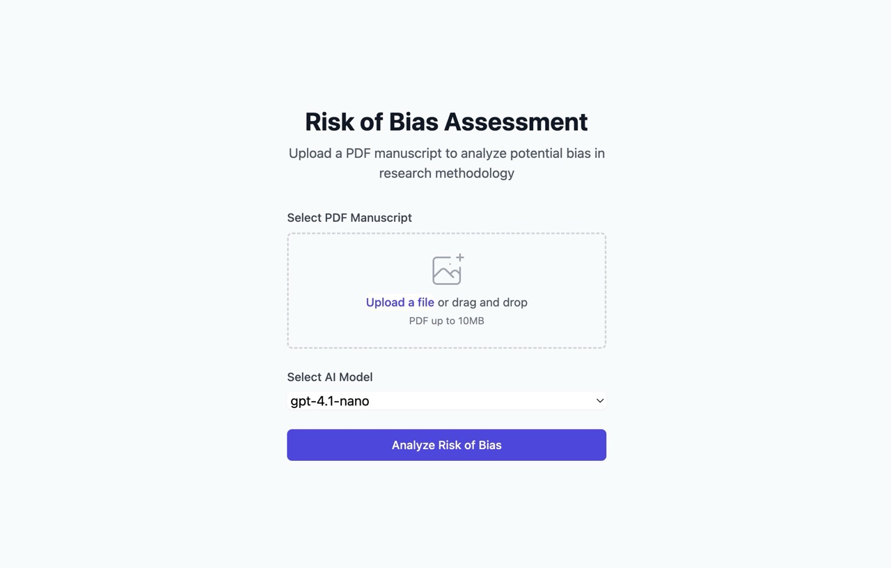

# Web Interface

A simple web front end is provided using [FastAPI](https://fastapi.tiangolo.com/).
It lets you upload a PDF and view the standard RoB2 HTML report directly in your
browser.



## Running the server

Install the optional dependencies and start the server with `risk-of-bias web` (equivalent to `make web`):

```console
pip install "risk_of_bias[web]"
risk-of-bias web
```

Open `http://127.0.0.1:8000` and upload your manuscript. After processing you
will see the report along with links to download the JSON and Markdown
representations.

If the `OPENAI_API_KEY` environment variable is not set when the server
starts, the upload form will include a field to provide it. When supplied,
the key is used for that analysis session.
